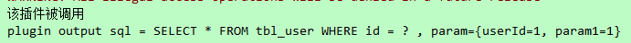

# The homework of Gupao College

## Factory Patterns
* package path : com.tal.gupao.patterns.factory
* unit test : com.tal.gupao.patterns.facotry.FactoryTest
>Scenario: GirlfriendFactory will give me a girlfriend according to where I am.

## Singleton Patterns
* package path : com.tal.gupao.patterns.singleton
* unit test: com.tal.gupao.patterns.singleton.SingletonTest
>Scenario: I am only who I am. There is not any person can replace me.

## Prototype Patterns
* package path : com.tal.gupao.patterns.prototype
* unit test : com.tal.gupao.patterns.singleton.SingletonTest
>Scenario: Fine-sounding message can clone to another girls. 

## Proxy Patterns
* package path :  com.tal.gupao.patterns.proxy
* unit test :  com.tal.gupao.patterns.proxy.ProxyTest
>Scenario: I want to watch a movie. I am using BaiduYun or Xunlei to download.

## Strategy Patterns
* package path : com.tal.gupao.patterns.strategy
* unit test : com.tal.gupao.patterns.strategy.StrategyTest
>Scenario: Download movie by two ways.

## Template Patterns
* package path : com.tal.gupao.patterns.template
* unit test : com.tal.gupao.patterns.template.TemplateTest
>Scenario: The most simple template method.

## Delegate Patterns
* package path : com.tal.gupao.patterns.delegate
* unit test : com.tal.gupao.patterns.delegate.DelegateTest
>Scenario: Make money.

## Adapter Patterns
* package path : com.tal.gupao.patterns.adapter
* unit test : com.tal.gupao.patterns.adapter.AdapterTest
>Scenario: Make an adapter to covert data from Android to iOS.

## Decorator Patterns
 * package path : com.tal.gupao.patterns.decorator
 * unit test : com.tal.gupao.patterns.decorator.DecoratorTest
 >Scenario: A pen only sell $1. But an art decorates it, it will become art pen. Art pen will sell $10.
 
 # Mybatis 
 ## Chapter 1
 1、 Mapper在spring管理下其实是单例，为什么可以是一个单例？ SCOPE -> application
>答：Mapper在spring中有SqlSessionTemplate和sqlSessionFactory获取两种方式，sqlSessionTemplate每次都返回不同的
DefaultSqlSession,而SqlSessionFactory每次都返回不同线程的SqlSession。而mapper是单例。

 | SqlSession               | Scope                     |
 | ------------------------ | ------------------------- |
 | SqlSessionFactoryBuilder | method                    |
 | SqlSessionFactory        | application               |
 | SqlSession               | request/method （线程级） |
 | Mapper                   | method                    |

 2、 MyBatis在Spring集成下没有mapper的xml文件会不会报错，为什么？
>答：不会，除了mapper的xml，还有annotation形式的Mybatis。

 3、 TypeHandler手写
>答：com.tal.gupao.mybatis.dao.handler.BlogTitleTypeHandler
使用：Namespace:com.tal.gupao.mybatis.mapper.BlogMapper
resultMap id='BaseResultMap'
## Chapter 2
 4、 多个interceptor到底谁先执行？顺序由谁决定的？
>答：com\tal\gupao\mybatis\plugins 手写Plugin。执行结果：后来居上。 
  
Executor > ParameterHandler > StatementHandler > ResultSetHandler

## Chapter 3
 5、 怎么验证一级缓存的存在？
>答：com.tal.gupao.mybatis.dao.PostRepository.验证一级缓存是否存在

 6、 验证N+1问题
 